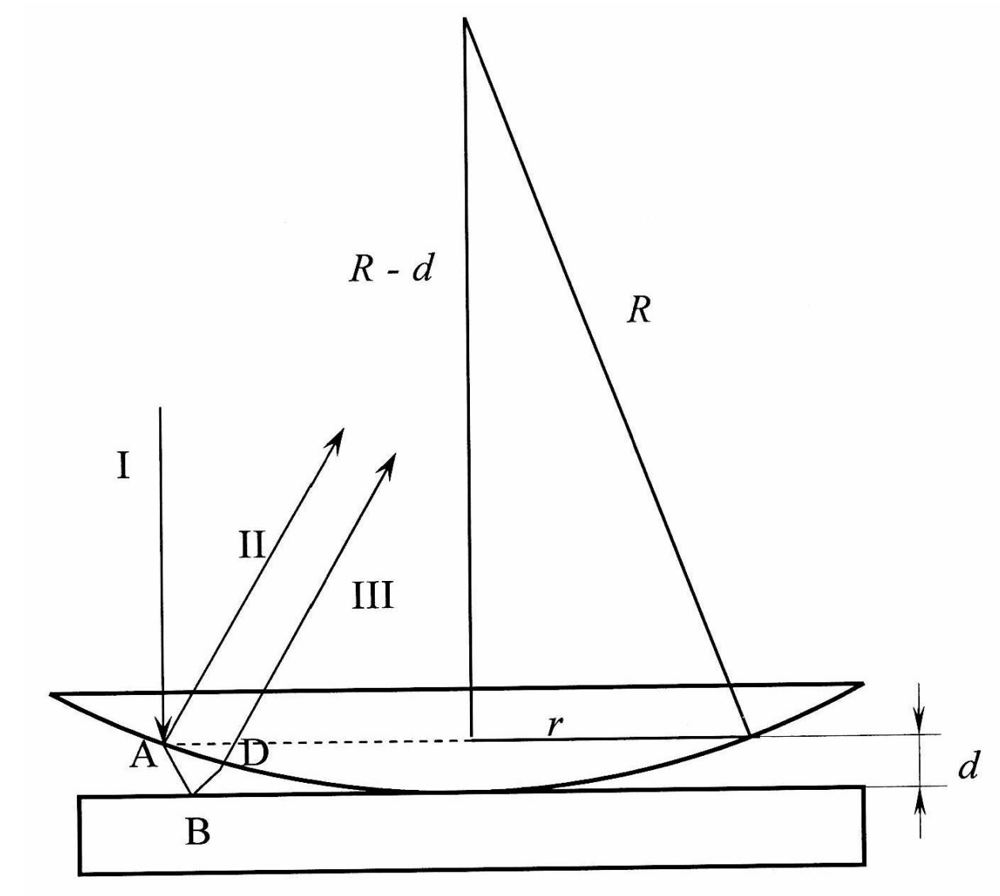
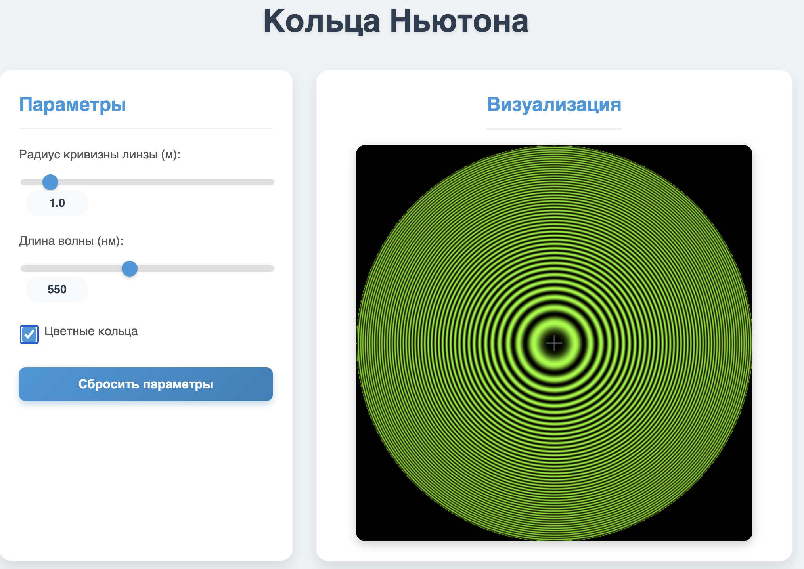
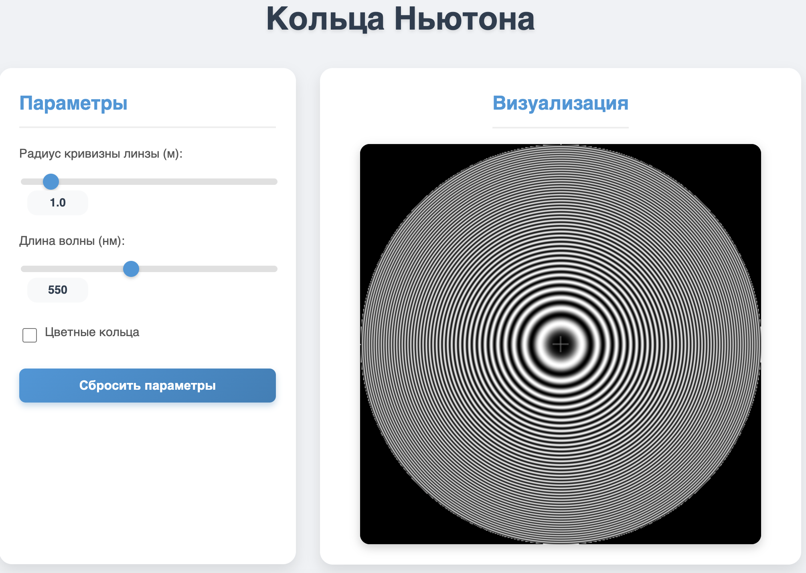
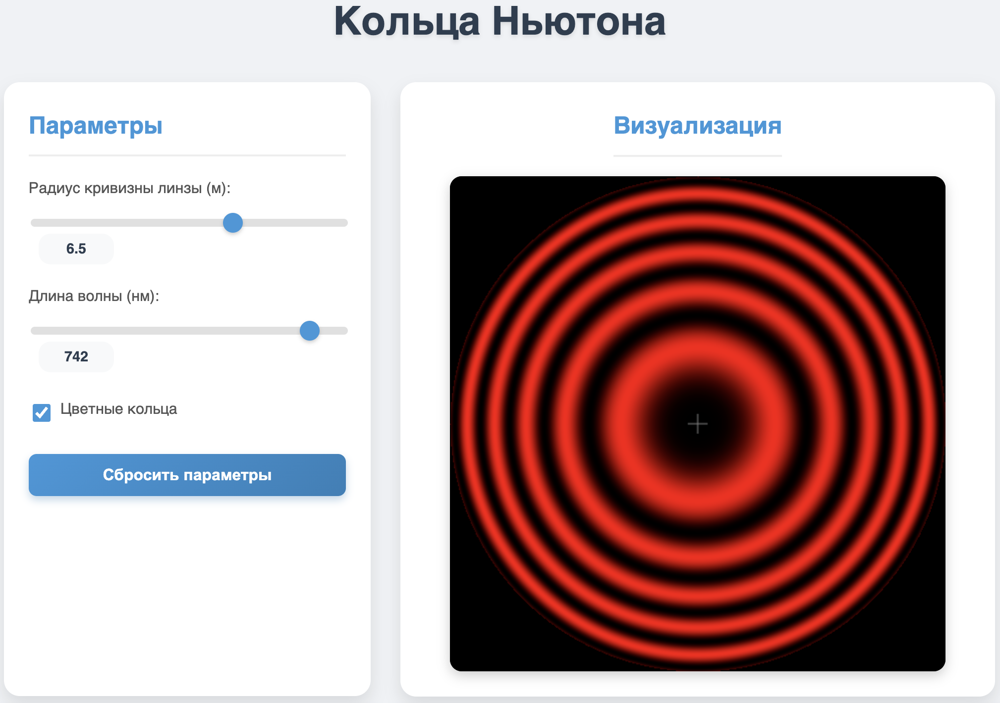

# Моделирование: Кольца Ньютона

## Задание

- Интерференция в тонкой воздушной прослойке между линзой и стеклом
- Функциональность:
    - Построение кольцевого распределения интенсивности
    - Параметры: радиус кривизны линзы, длина волны
    - Отображение колец Ньютона
    - Имитация смены длины волны (переход к разноцветным кольцам)

## Используемые формулы

1. **Толщина воздушной прослойки**:
   
   $d = \frac{r^2}{2R}$
   где:
   - $d$ — толщина воздушной прослойки,
   - $r$ — расстояние от центра системы (активная часть линзы, где образуются кольца Ньютона),
   - $R$ — радиус кривизны линзы.

2. **Оптическая разность хода** (учитывая сдвиг фазы при отражении):
   $\Delta = 2d + \frac{\lambda_0}{2}$

3. **Связь между разностью фаз и оптической разностью хода волн**:
   $\Delta \phi = \frac{2\pi \Delta}{\lambda_0}$

## Примеры

